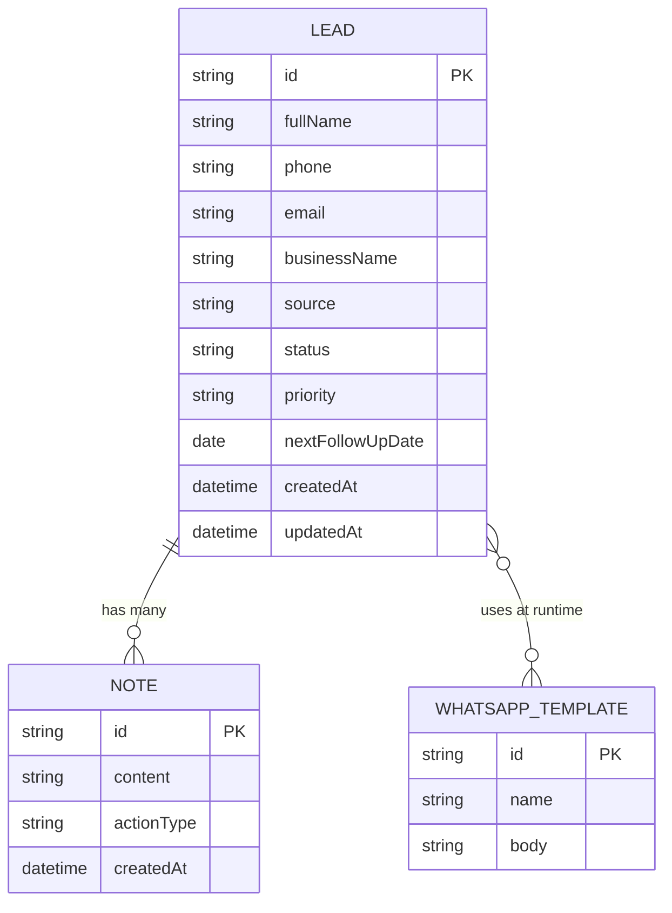

# LeadFlow AI — Data Model

## Entities

### Lead
The core entity. Each lead represents a potential customer in the sales pipeline.

| Field              | Type     | Required | Notes                                        |
|--------------------|----------|----------|----------------------------------------------|
| `id`               | string   | ✓        | UUID v4                                      |
| `fullName`         | string   | ✓        | Contact's full name                          |
| `phone`            | string   | ✓        | Israeli format, e.g. `050-1234567`           |
| `email`            | string   | ✓        | Must be valid email                          |
| `businessName`     | string   |          | Company / business name                     |
| `source`           | string   | ✓        | Enum: Website / LinkedIn / Referral / Cold Call / Event / Social Media / WhatsApp / Other |
| `status`           | string   | ✓        | Enum: New / Contacted / Follow Up / Proposal Sent / Closed Won / Closed Lost |
| `priority`         | string   | ✓        | Enum: High / Medium / Low                   |
| `nextFollowUpDate` | date     |          | ISO date string (YYYY-MM-DD)                |
| `notes`            | Note[]   |          | Array of activity/note objects              |
| `createdAt`        | datetime | ✓        | ISO 8601, set on create                     |
| `updatedAt`        | datetime | ✓        | ISO 8601, updated on every write            |

### Note (embedded in Lead)
Activity log entries attached to a Lead.

| Field        | Type     | Required | Notes                                       |
|--------------|----------|----------|---------------------------------------------|
| `id`         | string   | ✓        | UUID v4                                     |
| `content`    | string   | ✓        | Free-text note body                         |
| `actionType` | string   | ✓        | Enum: General / Call / WhatsApp / Meeting   |
| `createdAt`  | datetime | ✓        | ISO 8601                                    |

### WhatsAppTemplate
Pre-written message templates with variable substitution.

| Field      | Type   | Required | Notes                                    |
|------------|--------|----------|------------------------------------------|
| `id`       | string | ✓        | e.g. `tpl_1`                            |
| `name`     | string | ✓        | Human-readable label                    |
| `body`     | string | ✓        | Message text; `{name}` → contact name  |

### AIRecommendation (runtime only, not persisted)
Generated on demand per lead, never stored.

| Field        | Type   | Notes                            |
|--------------|--------|----------------------------------|
| `suggestion` | string | Hebrew text, rule-based          |
| `basedOn`    | object | `{ status, priority }` snapshot  |

---

## Relationships

```
Lead 1 ──< Note        (one lead has many notes, embedded)
Lead >── WhatsAppTemplate  (many leads use many templates, no FK — applied at runtime)
Lead ──> AIRecommendation  (computed on demand, not stored)
```

---

## CRUD Matrix

| Operation          | Lead | Note (via Lead) | Template | AI Rec |
|--------------------|------|-----------------|----------|--------|
| Create             | ✓    | ✓               | seed     | —      |
| Read (all)         | ✓    | ✓               | ✓        | —      |
| Read (by id)       | ✓    | ✓               | —        | —      |
| Update             | ✓    | —               | —        | —      |
| Delete             | ✓    | —               | —        | —      |
| Generate / Compute | —    | —               | ✓ apply  | ✓      |

---

## Storage Keys (LocalStorage)

| Key                  | Description                          |
|----------------------|--------------------------------------|
| `lf_v2_leads`        | JSON array of Lead objects           |
| `lf_v2_templates`    | JSON array of WhatsAppTemplate       |
| `lf_v2_initialized`  | boolean flag — prevents re-seeding   |

---

## Mermaid ERD



---

## Future Schema (Supabase)

When migrating to Supabase, the embedded `notes` array becomes a separate table:

```sql
-- leads table
create table leads (
  id              uuid primary key default gen_random_uuid(),
  full_name       text not null,
  phone           text not null,
  email           text not null,
  business_name   text,
  source          text not null,
  status          text not null default 'New',
  priority        text not null default 'Medium',
  next_follow_up  date,
  created_at      timestamptz default now(),
  updated_at      timestamptz default now()
);

-- lead_notes table
create table lead_notes (
  id          uuid primary key default gen_random_uuid(),
  lead_id     uuid references leads(id) on delete cascade,
  content     text not null,
  action_type text not null default 'General',
  created_at  timestamptz default now()
);

-- whatsapp_templates table
create table whatsapp_templates (
  id    text primary key,
  name  text not null,
  body  text not null
);
```
